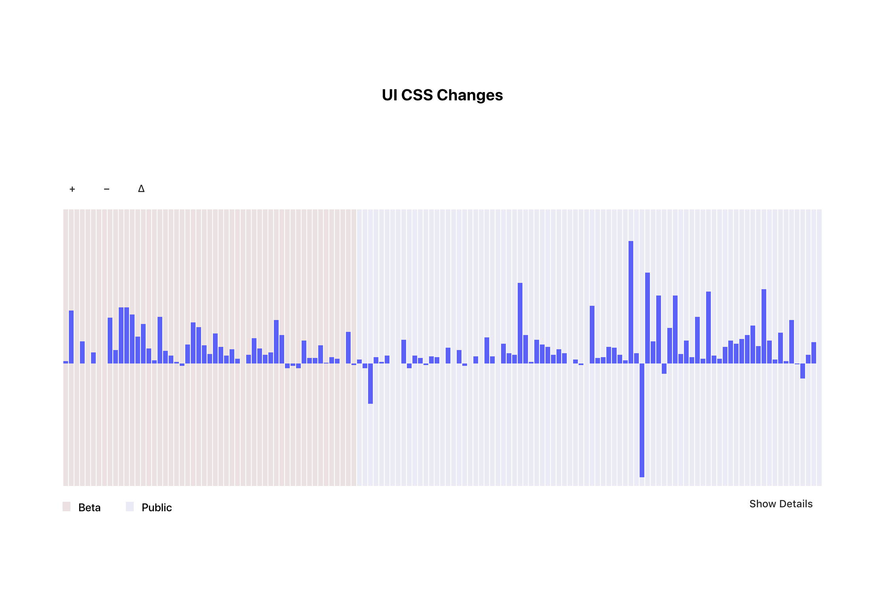
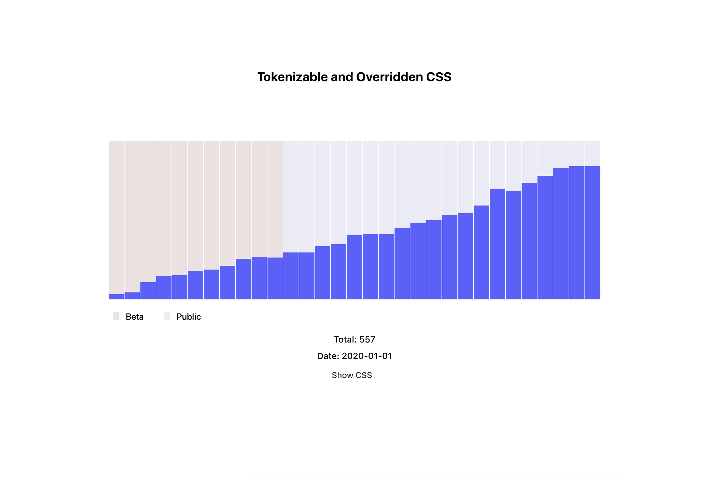
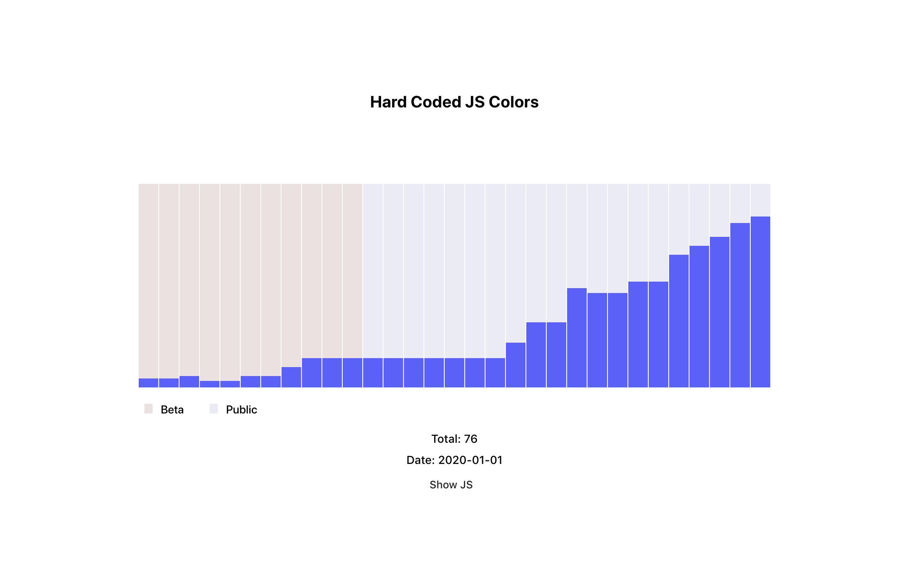
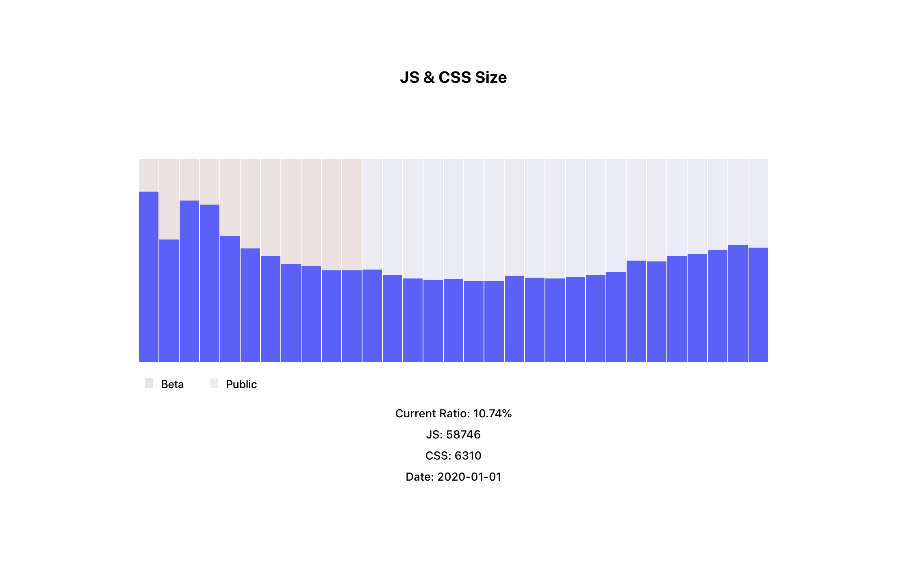

## UX Team OKR Dashboard

[View Dashboard](https://matchbox-okr.jambas.now.sh/) (Temporary)

A hacky dashboard that parses through 2web2ui to measure design system efficiency.


```bash
# To run this dashboard:
# First clone 2web2ui in a sibling directory to this one

# Install dependencies
npm i 

# Source data, will take a minute
npm run source:all

# Run Gatsby, which will open via localhost:8002
npm run start
```

---

### The Graphs


Tracks commits that include changes to `.scss` files by week. Insertions, deletions, and the delta are viewable.


Identifies inconsistent or custom CSS values. These should be referencing design tokens.


Identifies hard coded or custom JS color values. These should be referencing design tokens.


Measures the CSS to JS size ratio by number of lines.
